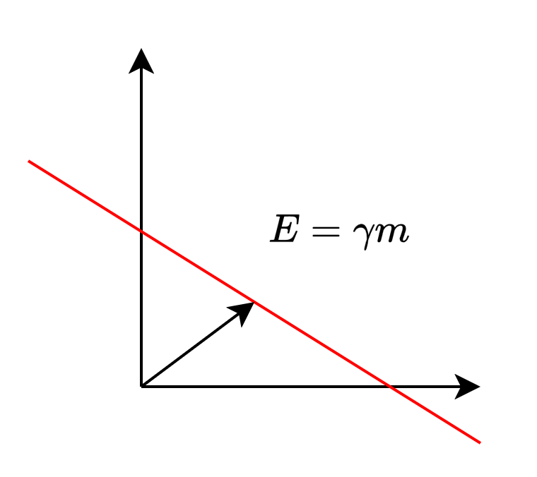
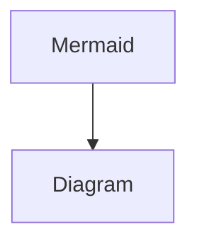

# Testseite

## Überschrift

Haus und :heart: und etwas <sup>Superscript</sup> und <sub>Subscript</sub>. Und <kbd>dann etwas</kbd> `mehr` von&#x20;


afffe


[https://www.ecosia.org](https://www.ecosia.org)

### Bild

* Hier kommt ein Bild in einer Column Umgebung



<div align="left" data-with-frame="true"><figure><figcaption><p>Hier kommt eine Caption</p></figcaption></figure></div>



<figure><figcaption></figcaption></figure>




<details>

<summary>Hier kommt ein expandable Bild</summary>

<div align="left" data-with-frame="true"><figure><figcaption></figcaption></figure></div>

</details>

## Draw


### Tabelle

Welcome to the company wiki! Here you'll find everything you need to know about the company.

Mein $$E=mc$$ und dann $$\displaystyle E=mc$$ Affe <kbd>Str</kbd>+<kbd>X</kbd>asd `Str`+`X`


[vision-and-values.md](vision-and-values.md)


|                           |                                                                           |
| ------------------------- | ------------------------------------------------------------------------- |
| Inline Latex `E=\gamma m` | Inline Latex $$E=\gamma m$$                                               |
| page                      |                                                                           |
| Link `/link`              | [#tee](testseite.md#tee "mention") [testseite.md](testseite.md "mention") |
| <h2>Heading 1</h2>        | <p>123123 asd<br><span class="math">a+b=c</span></p>                      |
| <h3>Heading 2</h3>        | `## Heading 2`                                                            |
| Inline Code               | `x = (a*2 for a in Tup)`                                                  |


```python
// Some code
import polars as pl
## Hier kommt die Definition
df = pl.DataFrame()
x = df.shape
```


### Tabs











### Columns



Hier kommt eine Spalte



Hier ist eine weitere Spalte







### GitHub Gist



### GitHub integration



### Stepper



#### Schnee

* seee
* Huas



#### Maus

```python
// Some code for you
```



### Mermaid



### Codeblock

```python
import numpy as np
```

<details>

<summary>Expandable Codeblock</summary>

<pre class="language-python"><code class="lang-python">// Some code
<strong>import polars as pl
</strong>## Hier kommt die Definition
df = pl.DataFrame()
x = df.shape
</code></pre>

</details>

### Expandable

<details>

<summary>Affenmann</summary>

* Schneehaus
* Maus

|                   |   |
| ----------------- | - |
| $$a+b=c$$         |   |
| Dann              |   |
| noch eine Tabelle |   |

</details>

### LaTeX

$$
\displaystyle
\int\limits_a^b f'(x)~dx = f(b)-f(a)
$$

$$
\begin{alignat*}{2}
\text{Taylor-Formel} &: 
& f(x_0+h) &= 
\Bigg[\sum\limits_{k=0}^{n}
\frac{h^k}{k!}~f^{(k)}(x_0)
\Bigg]_{\rm Potenzreihe}
~+~ \Bigg[R_{n+1}(x_0+h)
\Bigg]_{\rm Restglied}
\\[2em]
& &R_{n+1}(x_0+h)& = \frac{1}{n!}
\int\limits_{x_0}^{x_0+h}
(x_0+h-t)f^{(n+1)}(t)~dt
\\[2em]
\text{Taylor-Reihe} &:\quad
&T_f(x_0+h) &= \sum\limits_{k=0}^{\infty}
\frac{h^k}{k!}~f^{(k)}(x_0)
\end{alignat*}
$$
